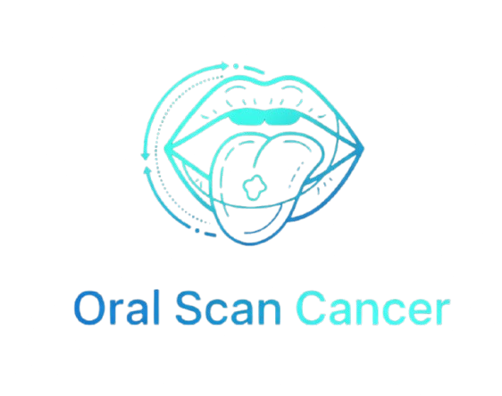

# 🦷 OralScan AI – AI-Based Early Oral Cancer Detection System

<p align="center">
  
</p>

<p align="center">
  <strong>Early Detection of Oral Cancer Using Artificial Intelligence</strong>
</p>

<p align="center">
  <a href="https://oralcancer-ashen.vercel.app/">🌐 Live Demo</a> •
  <a href="https://github.com/monaderrrr/oralCancer">📂 Repository</a>
</p>

---

## 📖 Overview

OralScan AI is an intelligent healthcare platform designed to assist in the early detection of oral cancer using Artificial Intelligence and Deep Learning technologies.

The system allows patients to upload oral images, answer medical questions, receive AI-powered risk assessments, connect with verified doctors, book appointments, and locate nearby healthcare facilities.

The platform aims to improve early diagnosis and increase accessibility to oral healthcare services.

---

## ✨ Key Features

### 👨‍⚕️ Patient Features

- Upload oral cavity images
- AI-powered oral cancer screening
- Hybrid diagnosis system
- Risk level prediction
- Scan history tracking
- Doctor consultation booking
- Real-time chat with doctors
- Nearby hospital finder
- Secure authentication

### 🩺 Doctor Features

- Doctor verification system
- Manage patient cases
- Review AI scan results
- Chat with patients
- Appointment management
- Medical profile management

### 🤖 AI Features

- Oral lesion detection
- Oral cancer risk classification
- Confidence score prediction
- Image validation
- CNN-based image analysis
- Questionnaire-based assessment

---

## 🏗️ System Architecture

```text
Patient
   │
   ▼
React Frontend
   │
   ├── Node.js Backend
   │
   └── FastAPI AI Service
            │
            ▼
      Deep Learning Model
```
